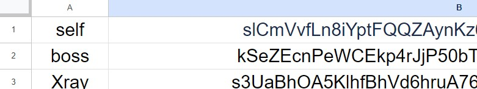

# Multi-Functional_LINE_Notify_BOT
This is a multi-functional messaging program that connects to the LINE Notify API on Colab. As long as you provide LINE Notify tokens, it can send messages, LINE stickers and images out as "LINE Notify". What's more, you can even send messages at specific times.

 ㅤ
### :star: If this project is helpful to you, please help star this repo. Thanks! :hugs:
 ㅤ
## Preparison
To use this project, please copy your LINE Notify token first. Otherwise, you need a Google account for accessing to your Google Drive, along with one (or more) "name+ (TAB)+LINE Notify token" stored row by row in a txt named `LineNotifyTokens.txt` in `/content/drive/MyDrive` of your Google Drive.

 ㅤ

  
   
  <em>▲ Example of LineNotifyTokens.txt ▲</em>
   

 ㅤ
 
:bell: The left side of each row in `LineNotifyTokens.txt` is the name of token named by your own and the right one is token, which are seperated by TAB(\t).

 ㅤ
## Installation

There is **NO** installation required for this project. (Precisely, installations will be processed in Colab notebook).

**Just open the Colab notebook** and run the code from top to bottom by clicking play buttons on the left side! 
Or you can press Ctrl+F9 to do so after setting all parameters if you're not willing to find play buttons or click them one by one.

 ㅤ

  
   
  <em>▲ Play buttons on the left side. ▲</em>
   

 ㅤ
 
## How to Use after Running the Code?
1. Choose the token number you want to send message with in cell `Tokens`, where all token numbers will be listed below.
2. Set Message to Send 

 ㅤ
## FAQ
:question: Cannot find `LineNotifyTokens.txt` in connected Google Drive since it doesn't exsist.

:bulb: Actually, tokens can be read from Google Sheet as well if there's a Google Sheet API file named GSheet.json in `/content/drive/MyDrive` of your Google Drive and your LINE Notify tokens and their names are stored in a Google Sheet row by row which already connects to Google Sheet API, which is convenient to edit on the smartphone. Provide the Google sheet id by opening the group in Colab named `Preprocessing` and fill it in `sheet_id` to do so. However, I suggest you to create a txt file with your own LINE Notify tokens and their names and upload it to your Google Drive, which may be a faster way to solve this problem. Or you can just key in an usable LINE Notify token and fill it in `LINE_Notify_API_token` if you don't wanna provide LINE Notify API tokens from Google Drive, which may be the fastest way to solve this problem while it's a little inconvenient for those having many tokens to choose.

 ㅤ

  
   
  <em>▲ The format of Google Sheet, where LINE Notify API tokens and their name are stored. ▲</em>
   
   
  
   
  <em>▲ You can fill in the Google sheet id here or change the path of LineNotifyTokens.txt and the one of API key (.json file) of Google Sheet. ▲</em>
   

 ㅤ
 
:question: Something different from the above.

:bulb: Send mail to pikasxyz@gmail.com and explain in detail.

 ㅤ 
## Reference

1. [List of available stickers | LINE Developers](https://developers.line.biz/en/docs/messaging-api/sticker-list/#sticker-definitions)
